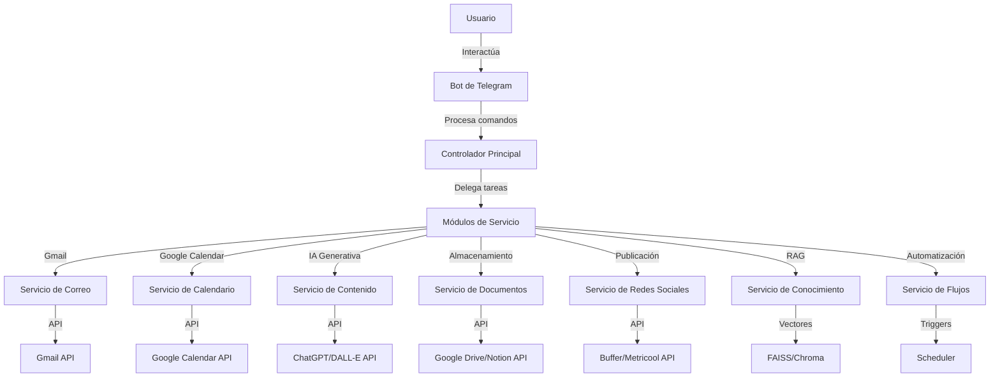

# Diseño del Sistema de Automatización Personal

## Visión General

Este documento describe el diseño técnico para un sistema de automatización personal gratuito que permite centralizar tareas de productividad y creación de contenido. El sistema se controlará principalmente a través de un bot de Telegram y utilizará exclusivamente herramientas y servicios gratuitos o de código abierto.

## Arquitectura

La arquitectura del sistema seguirá un patrón modular basado en microservicios, lo que permitirá añadir o modificar funcionalidades sin afectar al sistema completo. Esto facilitará la implementación progresiva de las diferentes características requeridas.



### Componentes Principales

1. **Bot de Telegram**: Interfaz principal de usuario que recibe comandos y envía respuestas.
2. **Controlador Principal**: Coordina las solicitudes y dirige a los módulos correspondientes.
3. **Módulos de Servicio**: Componentes especializados para cada funcionalidad.
4. **Base de Datos**: Almacenamiento local para configuraciones, índices vectoriales y caché.
5. **Adaptadores de API**: Interfaces para comunicación con servicios externos.

## Componentes e Interfaces

### 1. Bot de Telegram

El bot de Telegram será implementado utilizando la biblioteca `python-telegram-bot`, que proporciona una API completa para interactuar con la API de Telegram.

**Interfaces**:

- `/start`: Inicia la conversación y muestra opciones disponibles
- `/help`: Muestra comandos disponibles y su uso
- `/email`: Subcomandos para gestión de correo
- `/calendar`: Subcomandos para gestión de calendario
- `/content`: Subcomandos para generación de contenido
- `/storage`: Subcomandos para gestión de almacenamiento
- `/publish`: Subcomandos para publicación en redes sociales
- `/rag`: Subcomandos para generación basada en documentos
- `/flow`: Subcomandos para gestión de flujos de trabajo

### 2. Servicio de Correo

Este módulo gestionará la interacción con Gmail a través de su API oficial.

**Interfaces**:

- `read_emails(count, filter)`: Lee los correos más recientes
- `send_email(to, subject, body)`: Envía un correo electrónico
- `search_emails(query)`: Busca correos según criterios

**Implementación**:

- Utilizará la biblioteca `google-api-python-client` para interactuar con Gmail API
- Implementará OAuth 2.0 para autenticación segura
- Almacenará tokens de forma segura localmente

### 3. Servicio de Calendario

Gestiona eventos en Google Calendar mediante su API oficial.

**Interfaces**:

- `get_events(start_date, end_date)`: Obtiene eventos en un rango de fechas
- `create_event(title, start, end, description)`: Crea un nuevo evento
- `delete_event(event_id)`: Elimina un evento existente

**Implementación**:

- Utilizará la biblioteca `google-api-python-client` para interactuar con Calendar API
- Compartirá la infraestructura de autenticación con el Servicio de Correo

### 4. Servicio de Contenido

Genera texto e imágenes utilizando modelos de IA gratuitos.

**Interfaces**:

- `generate_text(prompt, style, length)`: Genera texto según parámetros
- `generate_image(prompt, style, size)`: Genera imágenes según parámetros
- `refine_content(content, feedback)`: Refina contenido existente

**Implementación**:

- Para texto: Utilizará `openai` con el modelo gratuito o `llama-index` con modelos locales
- Para imágenes: Utilizará `openai` con DALL-E gratuito o alternativas como `stable-diffusion`
- Implementará un sistema de caché para optimizar uso de APIs gratuitas

### 5. Servicio de Documentos

Gestiona el almacenamiento y recuperación de documentos e ideas.

**Interfaces**:

- `save_document(content, title, tags)`: Guarda contenido en almacenamiento
- `get_document(id)`: Recupera un documento específico
- `search_documents(query)`: Busca documentos por contenido o metadatos

**Implementación**:

- Para Google Drive: Utilizará `google-api-python-client`
- Para Notion: Utilizará `notion-client`
- Implementará un sistema de caché local para documentos frecuentes

### 6. Servicio de Redes Sociales

Gestiona la publicación y programación de contenido en redes sociales.

**Interfaces**:

- `publish_now(platform, content, media)`: Publica contenido inmediatamente
- `schedule_post(platform, content, media, datetime)`: Programa publicación
- `get_scheduled()`: Obtiene lista de publicaciones programadas

**Implementación**:

- Para Buffer: Utilizará la API REST de Buffer con plan gratuito
- Para Metricool: Utilizará la API REST de Metricool con plan gratuito
- Implementará un scheduler local para plataformas sin API de programación

### 7. Servicio de Conocimiento (RAG)

Implementa el sistema RAG para generación de contenido basado en documentos personales.

**Interfaces**:

- `index_document(document)`: Indexa un documento para RAG
- `generate_with_context(prompt, filters)`: Genera contenido usando RAG
- `explain_sources(generation_id)`: Explica fuentes utilizadas

**Implementación**:

- Utilizará `llama-index` o `langchain` como framework principal
- Implementará vectorización local con `FAISS` o `Chroma`
- Utilizará modelos de embedding gratuitos como `all-MiniLM-L6-v2`

### 8. Servicio de Flujos

Gestiona la creación y ejecución de flujos de trabajo automatizados.

**Interfaces**:

- `create_flow(trigger, actions)`: Crea un nuevo flujo de trabajo
- `execute_flow(flow_id, params)`: Ejecuta un flujo manualmente
- `list_flows()`: Lista flujos disponibles

**Implementación**:

- Utilizará un motor de reglas simple basado en eventos
- Implementará un scheduler para triggers basados en tiempo
- Almacenará definiciones de flujos en formato JSON

## Modelos de Datos

### Usuario

```json
{
  "user_id": "string",
  "telegram_id": "string",
  "google_tokens": {
    "access_token": "string",
    "refresh_token": "string",
    "expiry": "datetime"
  },
  "notion_token": "string",
  "buffer_token": "string",
  "metricool_token": "string",
  "preferences": {
    "default_calendar": "string",
    "notification_level": "enum(minimal, normal, verbose)",
    "timezone": "string"
  }
}
```

### Documento

```json
{
  "doc_id": "string",
  "title": "string",
  "content": "string",
  "created_at": "datetime",
  "updated_at": "datetime",
  "tags": ["string"],
  "storage_location": "enum(local, gdrive, notion)",
  "external_id": "string",
  "vector_id": "string"
}
```

### Contenido Generado

```json
{
  "content_id": "string",
  "type": "enum(text, image)",
  "prompt": "string",
  "result": "string/binary",
  "created_at": "datetime",
  "parameters": "json",
  "sources": ["string"],
  "published": "boolean",
  "publication_details": {
    "platform": "string",
    "post_id": "string",
    "scheduled_time": "datetime",
    "status": "enum(draft, scheduled, published, failed)"
  }
}
```

### Flujo de Trabajo

```json
{
  "flow_id": "string",
  "name": "string",
  "trigger": {
    "type": "enum(time, event, command)",
    "parameters": "json"
  },
  "actions": [
    {
      "service": "string",
      "method": "string",
      "parameters": "json",
      "next_on_success": "integer",
      "next_on_failure": "integer"
    }
  ],
  "created_at": "datetime",
  "last_run": "datetime",
  "status": "enum(active, inactive, error)"
}
```

## Manejo de Errores

El sistema implementará un manejo de errores en múltiples niveles:

1. **Nivel de API Externa**: Captura errores de servicios externos (límites de API, autenticación, etc.)

   - Implementará reintentos con backoff exponencial
   - Rotación de APIs cuando sea posible (ej. alternativas de IA)

2. **Nivel de Servicio**: Maneja errores específicos de cada módulo

   - Logging detallado para diagnóstico
   - Respuestas de error estructuradas

3. **Nivel de Controlador**: Coordina respuestas de error al usuario

   - Mensajes amigables en Telegram
   - Opciones de recuperación cuando sea posible

4. **Persistencia de Estado**: Garantiza que las operaciones sean recuperables
   - Almacenamiento de estado de operaciones largas
   - Capacidad de reanudar operaciones interrumpidas

## Estrategia de Pruebas

### Pruebas Unitarias

- Cada módulo de servicio tendrá pruebas unitarias para sus funciones principales
- Se utilizará `pytest` como framework de pruebas
- Se implementarán mocks para APIs externas

### Pruebas de Integración

- Pruebas de integración entre módulos internos
- Pruebas con APIs reales usando cuentas de sandbox cuando estén disponibles

### Pruebas End-to-End

- Escenarios completos simulando interacciones de usuario
- Pruebas de flujos de trabajo automatizados

### Pruebas de Límites

- Verificación de comportamiento con límites de APIs gratuitas
- Pruebas de recuperación ante fallos de servicios externos

## Consideraciones de Despliegue

### Opción 1: Despliegue Local

- Requisitos: Python 3.8+, ~500MB de espacio en disco
- Persistencia: SQLite para datos estructurados, sistema de archivos para vectores
- Ejecución: Script de inicio o servicio systemd
- Ventajas: Control total, sin límites de tiempo de ejecución
- Desventajas: Requiere que la computadora esté encendida

### Opción 2: Despliegue en Servicios Gratuitos

- Plataformas compatibles: Render, Railway, Replit, Glitch
- Consideraciones:
  - Límites de tiempo de actividad (solución: endpoints de ping)
  - Límites de almacenamiento (solución: almacenamiento externo)
  - Límites de CPU/RAM (solución: optimización de recursos)

### Opción 3: Híbrida

- Bot y API en servicio gratuito en la nube
- Procesamiento pesado (RAG, generación) en equipo local
- Comunicación mediante webhooks o polling
- Ventajas: Disponibilidad constante con recursos locales cuando se necesiten

## Extensibilidad

El sistema está diseñado para ser extensible en varias dimensiones:

1. **Nuevos Servicios**: Estructura modular permite añadir nuevos servicios
2. **Alternativas Gratuitas**: Adaptadores para cambiar entre diferentes APIs
3. **Nuevas Plataformas**: Soporte para publicación en más redes sociales
4. **Modelos Locales**: Capacidad de usar modelos de IA locales cuando estén disponibles
