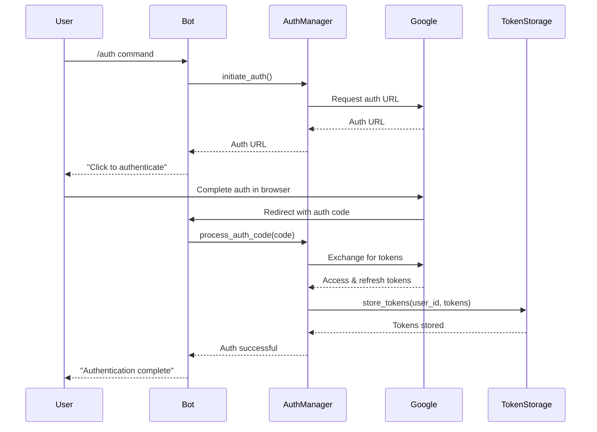

# Design Document: Simplified Google Integration

## Overview

This design document outlines the architecture and implementation details for a simplified version of the Personal Automation Bot that focuses exclusively on Google service integrations (Calendar, Gmail, and Drive) with a streamlined authentication process. The system will be built as a Telegram bot that provides a user-friendly interface to access and manage Google services.

The primary goal is to create a focused, reliable bot that handles essential productivity tasks while simplifying the setup and authentication process. By limiting the scope to core Google services and implementing a unified authentication flow, we can deliver a more streamlined user experience.

## Architecture

The system follows a modular architecture with clear separation of concerns:

```
┌─────────────────┐     ┌───────────────────┐     ┌─────────────────┐
│                 │     │                   │     │                 │
│  Telegram Bot   │◄────┤  Service Layer    │◄────┤  Google APIs    │
│  Interface      │     │                   │     │                 │
│                 │     │                   │     │                 │
└─────────────────┘     └───────────────────┘     └─────────────────┘
```

### Key Components:

1. **Telegram Bot Interface**: Handles user interactions, commands, and conversations
2. **Service Layer**: Contains business logic for each Google service integration
3. **Authentication Manager**: Provides unified authentication for all Google services
4. **Google API Clients**: Interfaces with Google Calendar, Gmail, and Drive APIs
5. **Storage Manager**: Handles secure storage of authentication tokens and user preferences

## Components and Interfaces

### 1. Telegram Bot Interface

The bot interface will be implemented using the python-telegram-bot library and will handle:

- Command processing
- Conversation flows
- Inline keyboards and menus
- Error handling and user feedback

**Key Classes:**

- `Bot`: Main bot class that initializes and configures the Telegram bot
- `CommandHandler`: Processes user commands
- `ConversationHandler`: Manages multi-step conversations
- `CallbackQueryHandler`: Handles inline keyboard interactions

**Command Structure:**

- `/start`: Initialize the bot and authentication
- `/help`: Display available commands and usage instructions
- `/auth`: Manage authentication
- `/calendar`: Access calendar features
- `/email`: Access email features
- `/drive`: Access drive features

### 2. Authentication Manager

The Authentication Manager will handle the unified Google authentication process:

**Key Classes:**

- `AuthManager`: Manages the OAuth2 flow for Google services
- `TokenStorage`: Securely stores and retrieves authentication tokens

**Authentication Flow:**

1. User initiates authentication via bot command
2. System generates OAuth2 URL and sends to user
3. User completes authentication in browser
4. Google redirects to bot with authorization code
5. System exchanges code for access and refresh tokens
6. Tokens are securely stored for future use
7. System uses refresh tokens to maintain access without user intervention



### 3. Google Service Clients

Each Google service will have a dedicated client class:

**Calendar Client:**

- `CalendarClient`: Interfaces with Google Calendar API
- Methods:
  - `get_events(date_range)`: Retrieve events for a date range
  - `create_event(event_data)`: Create a new calendar event
  - `update_event(event_id, event_data)`: Update an existing event
  - `delete_event(event_id)`: Delete an event

**Email Client:**

- `GmailClient`: Interfaces with Gmail API
- Methods:
  - `get_messages(query, max_results)`: Retrieve emails matching query
  - `get_message(message_id)`: Get full email content
  - `send_message(to, subject, body)`: Send an email
  - `reply_to_message(message_id, body)`: Reply to an email

**Drive Client:**

- `DriveClient`: Interfaces with Google Drive API
- Methods:
  - `list_files(query, max_results)`: List files matching query
  - `upload_file(file_path, folder_id)`: Upload a file
  - `download_file(file_id, destination)`: Download a file
  - `share_file(file_id, email, role)`: Share a file with permissions

### 4. Service Layer

The service layer will provide business logic and coordinate between the bot interface and Google clients:

**Key Services:**

- `CalendarService`: Calendar management logic
- `EmailService`: Email management logic
- `DriveService`: File management logic

Each service will:

- Handle data validation and formatting
- Coordinate complex operations
- Provide error handling and recovery
- Format responses for the bot interface

### 5. Storage Manager

The Storage Manager will handle secure storage of:

- Authentication tokens
- User preferences
- Temporary conversation state

**Implementation:**

- File-based storage with encryption for tokens
- Directory structure organized by user ID
- Automatic cleanup of expired or invalid tokens

## Data Models

### User Model

```python
class User:
    user_id: str  # Telegram user ID
    first_name: str
    last_name: str
    auth_status: bool  # Whether user is authenticated
```

### Calendar Event Model

```python
class CalendarEvent:
    event_id: str
    title: str
    start_time: datetime
    end_time: datetime
    description: str
    location: str
    attendees: List[str]
```

### Email Message Model

```python
class EmailMessage:
    message_id: str
    thread_id: str
    sender: str
    recipients: List[str]
    subject: str
    body: str
    date: datetime
    has_attachments: bool
    attachments: List[Attachment]
```

### Drive File Model

```python
class DriveFile:
    file_id: str
    name: str
    mime_type: str
    size: int
    created_time: datetime
    modified_time: datetime
    web_view_link: str
    parents: List[str]
```

## Error Handling

The system will implement a comprehensive error handling strategy:

1. **API Errors**: Handle Google API errors with appropriate retry logic and user feedback
2. **Authentication Errors**: Detect expired or invalid tokens and guide users through re-authentication
3. **Network Errors**: Implement retry mechanisms with exponential backoff
4. **User Input Errors**: Validate input and provide clear error messages
5. **Unexpected Errors**: Log detailed information while providing user-friendly messages

Error responses will follow this format:

- Clear error message explaining what went wrong
- Suggested action to resolve the issue
- Option to retry or cancel the operation

## Testing Strategy

The testing strategy will include:

1. **Unit Tests**: Test individual components in isolation

   - Service methods
   - API client methods
   - Bot command handlers

2. **Integration Tests**: Test interactions between components

   - Authentication flow
   - Service-to-API interactions
   - Bot-to-service interactions

3. **End-to-End Tests**: Test complete user flows

   - Authentication process
   - Calendar event creation
   - Email sending and reading
   - File upload and sharing

4. **Mock Testing**: Use mock objects to simulate:

   - Google API responses
   - Telegram bot interactions
   - Authentication flows

5. **Error Case Testing**: Verify proper handling of:
   - API errors and rate limits
   - Authentication failures
   - Network interruptions
   - Invalid user input

## Security Considerations

1. **Token Storage**: Encrypt all authentication tokens at rest
2. **Secure Communication**: Use HTTPS for all API communications
3. **Minimal Permissions**: Request only necessary OAuth scopes
4. **Token Refresh**: Implement secure token refresh procedures
5. **User Verification**: Verify Telegram user identity before accessing sensitive data
6. **Credential Protection**: Never log or expose authentication credentials
7. **Session Management**: Implement proper session handling and timeout

## Implementation Plan

The implementation will follow this phased approach:

1. **Phase 1: Core Infrastructure**

   - Set up project structure
   - Implement authentication manager
   - Create storage manager
   - Set up basic bot framework

2. **Phase 2: Google Calendar Integration**

   - Implement calendar client
   - Create calendar service
   - Develop calendar command handlers
   - Build calendar conversation flows

3. **Phase 3: Gmail Integration**

   - Implement Gmail client
   - Create email service
   - Develop email command handlers
   - Build email conversation flows

4. **Phase 4: Google Drive Integration**

   - Implement Drive client
   - Create Drive service
   - Develop Drive command handlers
   - Build Drive conversation flows

5. **Phase 5: Refinement and Testing**
   - Comprehensive testing
   - Error handling improvements
   - User experience refinements
   - Documentation
